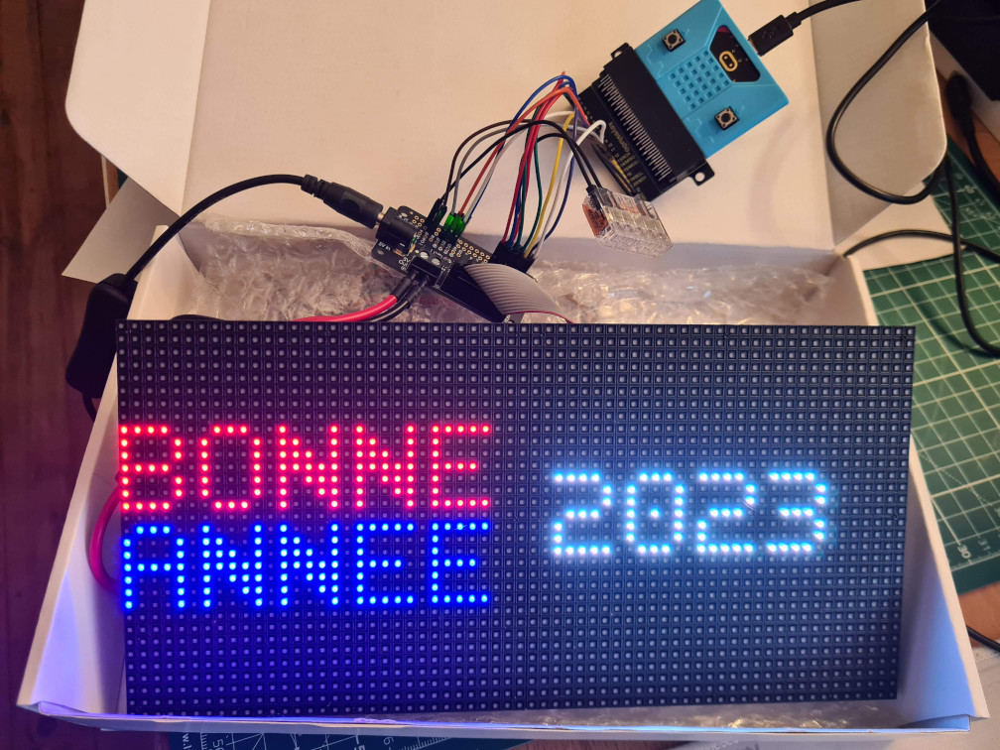

# LED Matrix usage with BBC Microbit

## Deployment

To deploy, you must set up the tools described in the Rust [Discovery Book]. Notably:
- Rust (obviously)
- Cargo Embed
- Arm GCC toolchain
- The Rust/LLVM target `thumbv7em-none-eabihf` for micro:bit v2

**This project is already configured to be specifically deployed on the micro:bit v2.
The memory map is notably prepared for the nrf52833 chip.**

Once they are installed:

    $ cargo embed --release

Some examples are also presents in the `examples/` directory. To use them:

    $ cargo embed --release --example raw-simple-display

Unless you need to debug, you should use the release version. The matrix needs frequent refreshes,
which may be impeded by the unoptimized code version.

[Discovery Book]: https://docs.rust-embedded.org/discovery/

## Resources

What mainly helped me is:

- [Adafruit matrix panel overview] - Wiring and working guide, aims Arduino
- [hzeller GitHub] - Wiring and working guide, also explain some issues if using a 3.3V logic circuits like with Cortex-M.
- [Big Mess o' Wires] - Basic working example, which helped understand the correct OE/Line/Latch sequence and confirmed 
  some issues I had when not modifying the line selection.

Some additional related resources:
- [Adafruit matrix panel code]
- [Binary code modulation explanation]
- [Rust port of code for Rasperry Pi]

[Adafruit matrix panel overview]: https://learn.adafruit.com/32x16-32x32-rgb-led-matrix/overview
[Adafruit matrix panel code]: https://github.com/adafruit/RGB-matrix-Panel
[Big Mess o' Wires]: https://www.bigmessowires.com/2018/05/24/64-x-32-led-matrix-programming/
[hzeller GitHub]: https://github.com/hzeller/rpi-rgb-led-matrix
[Binary code modulation explanation]: http://www.batsocks.co.uk/readme/art_bcm_1.htm
[Rust port of code for Rasperry Pi]: https://github.com/EmbersArc/rpi_led_panel

## Various notes

- I have issues in writting some unit tests, with the message `can't find crate
  for 'test'`. Possibly related to the use of `no_std` target.

## License

MIT License

Copyright (c) 2022, 2023 Vincent Hiribarren

Permission is hereby granted, free of charge, to any person obtaining a copy
of this software and associated documentation files (the "Software"), to deal
in the Software without restriction, including without limitation the rights
to use, copy, modify, merge, publish, distribute, sublicense, and/or sell
copies of the Software, and to permit persons to whom the Software is
furnished to do so, subject to the following conditions:

The above copyright notice and this permission notice shall be included in all
copies or substantial portions of the Software.

THE SOFTWARE IS PROVIDED "AS IS", WITHOUT WARRANTY OF ANY KIND, EXPRESS OR
IMPLIED, INCLUDING BUT NOT LIMITED TO THE WARRANTIES OF MERCHANTABILITY,
FITNESS FOR A PARTICULAR PURPOSE AND NONINFRINGEMENT. IN NO EVENT SHALL THE
AUTHORS OR COPYRIGHT HOLDERS BE LIABLE FOR ANY CLAIM, DAMAGES OR OTHER
LIABILITY, WHETHER IN AN ACTION OF CONTRACT, TORT OR OTHERWISE, ARISING FROM,
OUT OF OR IN CONNECTION WITH THE SOFTWARE OR THE USE OR OTHER DEALINGS IN THE
SOFTWARE.
